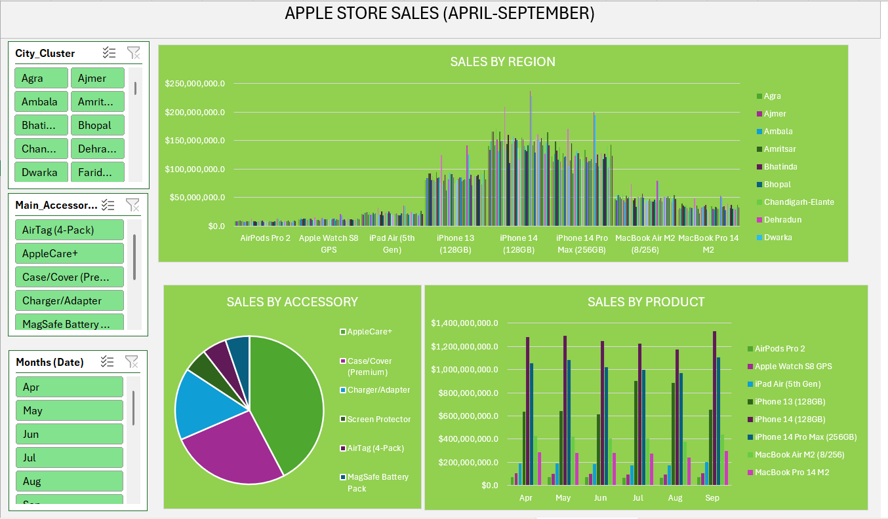

# Apple Store North India Data Analysis 

An interactive Excel Sales Dashboard built to analyze sales performance, regional trends, and product insights using Pivot Tables, charts, slicers, and KPI metrics.
---
## Project Overview
This dashboard transforms raw sales data into meaningful business insights through data visualization and interactive reporting.
The dashboard helps track:

- Total Sales
- Regional Performance
- Product Performance
- Monthly Sales Trends
- Business KPIs

---

## Features

- Interactive dashboard
- Dynamic charts and visualizations
- Pivot Tables and Pivot Charts
- Slicers for filtering data
- KPI cards for quick insights
- Region-wise sales analysis
- Product sales comparison
- Monthly sales trend analysis

---

## Tools & Techniques Used

- Microsoft Excel
- Pivot Tables
- Pivot Charts
- Slicers
- Conditional Formatting
- Data Cleaning
- Data Visualization

---

## Dashboard Preview

---

## Dataset Information

The dataset contains sales transaction records including:

- Product
- Region
- Month
- Sales
- Quantity
- Profit

Note: The dataset was reduced for GitHub upload and portfolio demonstration purposes. 

## KPIs (Key Performance Indicators)

The dashboard tracks the following key metrics:

- Top performing Accessory -Accessory with the highest sales
- Top Performing Product – Product with the highest sales
- Top Performing Region – Region contributing the most revenue

---

## Key Insights

- Sales performance varies significantly across different regions.
- Apple+ care, Case/cover and screen protector are the highest selling accessori
- september is the month with the highest number of sales with apple watch s8 GPS highest sales
- Deharadun is the region with the highest sales
- 1phone 14 (128) is the highest selling product
- Monthly sales trends show fluctuations, indicating possible seasonal demand.
- Certain products perform better in specific regions.
- Peak sales periods can be identified for better business planning.

---

## Conclusions

- Product type has a strong relationship with accessory sales, meaning accessories are often purchased alongside specific product categories.
  
- New product releases tend to generate higher revenue compared to older models. For example, the iPhone 14 (128GB) shows stronger performance, indicating that more focus should be placed on stocking and promoting new iPhone releases rather than older versions.
  
- Region strongly influences overall sales performance, with some regions consistently outperforming others.
  
- High-performing products and regions should be prioritized to maximize overall revenue.
  
- Underperforming segments may require targeted marketing strategies to improve performance and demand.

- Seasonal trends can be used to improve forecasting accuracy and optimize inventory planning.

- Overall, the dashboard provides clear, data-driven insights that support better business decision-making.
